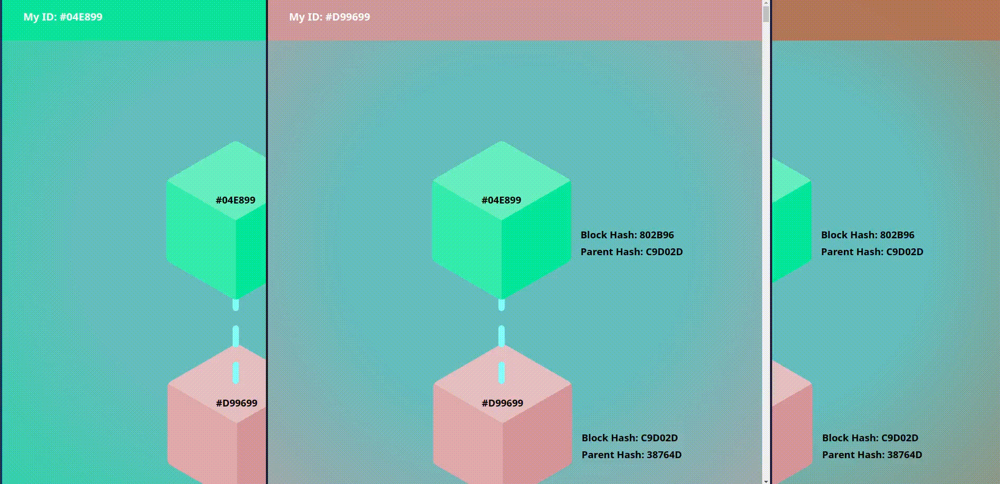
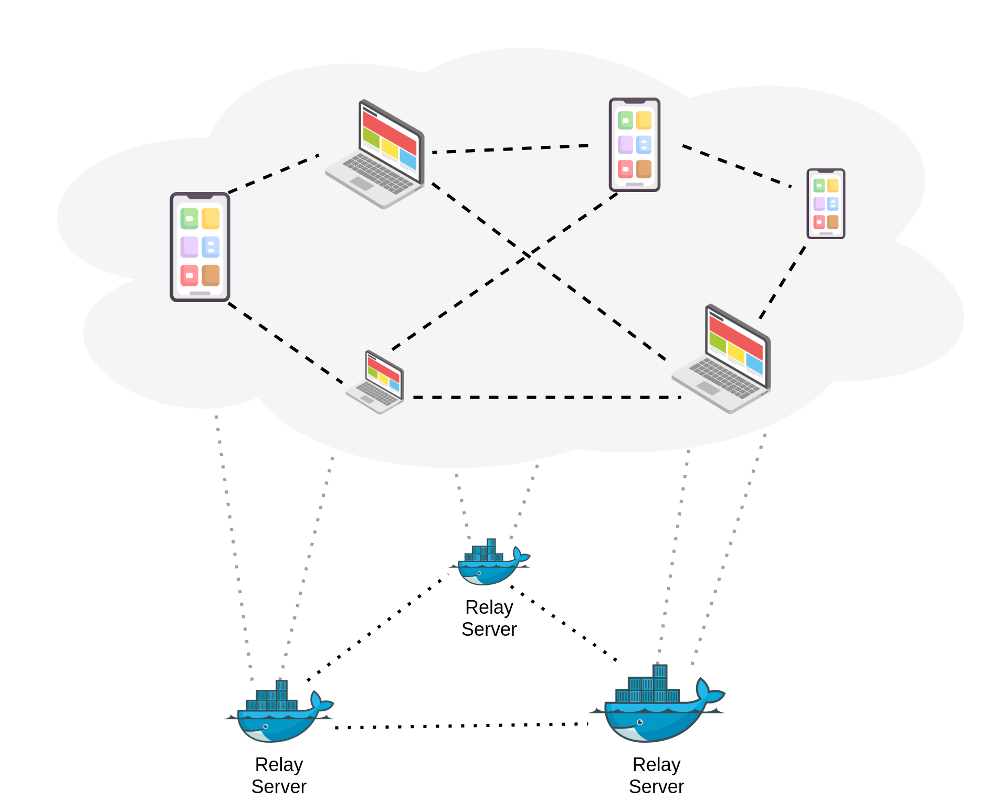
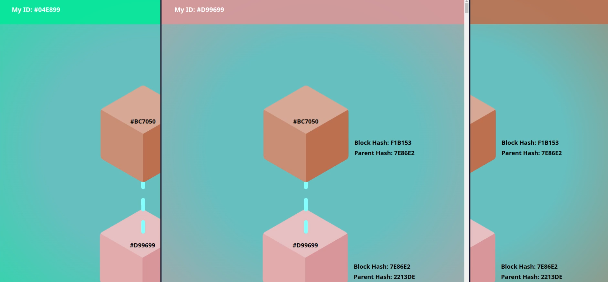

# In-Browser Proof-of-Work

> 
> Animated GIF of the In-Browser Proof-of-Work.

Along with the seminar research, a simple practical prototype was developed to demonstrate the effectiveness of Proof-of-Work as a permissionless consensus protocol. The prototype was developed with the idea of being accessible to any device that supports the modern features of web browsers. Indeed, this prototype can run in a seemingly decentralized fashion, being delivered as a static web page, without the inherent need for a centralized hosting or backend server. The next sections will give more details about the implementation and design considerations, as well as a short set of remarks and future work.

### Implementation

This prototype was developed and shipped as a static web page. The base layer tooling choice resided in the *Nuxt.js* framework, a meta-framework for building web applications based on *Vue.js*. With that established, it became clear the need for a protocol for syncing and communicating in a peer-to-peer way between the devices. The choice resided in the *GUN* ecosystem, which ships a small but powerful set of tools for in-browser data synchronization. Since there was *TypeScript* support from all the major dependencies of this project, this was the language chosen for the interactive web development typescript. The cryptographic standards used in the *PoW* algorithm were imported from the *crypto-js* library. And, finally, HTML and CSS, with the help of the *Tailwind CSS* framework were used for styling and presentation.



> Fig. 1: The topology of the system, with an underlay network of relay servers that allow the overlay network of devices to discover their peers and establish direct connections.

A major requirement for such a system is the capacity for parallel computations, in order to be able to, simultaneously, listen for and validate proposed blocks, present the current results in the screen, and mine new blocks. The traditional *JavaScript* computation model is a single-threaded environment that, naturally, does not allow for the efficient and effective handling of all these scenarios, happening at the same time. Most of the modern web browsers have a living solution for this problem, and that is based on *Web Workers*. This *API* was used in order to offload the expensive mining computations and take that burden out of the main thread, leaving it with the responsibility of listening for information updates, either from other peers, with proposed blocks, or from the *miner* threads, with new mined blocks, and decide and update the user interface accordingly.

The remaining piece of the puzzle is the device discovery issue. The way the internet works does not allow for direct device pairing and easy peer discovery. The modern web generally follows a client-server model with the centralization of resources. And, for this project, there was the need for a mechanism that would allow the peers to connect to each other to then proceed to synchronize the information. The *GUN* ecosystem established a commonly accepted solution for this issue, that, very shortly, depends on setting up *relay* peers that have somewhat static addresses and that can serve as reference points and pairing gateways for the nodes to discover and establish direct communications with their peers. For development and demonstration purposes, multiple relay nodes were set up, running as *Docker* containers, with static ports and addresses, that could then be referenced in the web page generation, for the other mobile and dynamic peers to connect to and make contacts with the rest of the network. The communication fashion is abstracted by the libraries used, but, generally, it happens either via *WebSockets* or *WebRTC* technology. Figure 1 shows the topology of the whole system.

### Remarks

The prototype was tested, is demonstrable and works as intended. Some *Nakamoto* chain-based features were simplified, for the sake of maintaining a didactic complexity. For example, the Longest-Chain rule, in this prototype, works by having a temporary set of active blocks that get appended to the main chain if there are new blocks mined on top of them. This setting enforces higher synchrony between the peers, as there is also no mechanism for general chain data synchronization. Additionally, this means that a new peer joining the network does not need or does not ask for the rest of the chain history to start mining, but just the most recent block. The difficulty was also set to a constant value, for the sake of simplicity. Again, this is justified by the purpose of this prototype, which was to demonstrate the achievement of consensus in a permissionless environment.

No extensive benchmarks or analysis were made, other than live tests with multiple and heterogeneous devices. The basic tests involved one, two or more browser tabs opened in the same device, competing for mining the blocks. The distribution of blocks mined in a fixed and considerable interval was observed to be uniform for the participants. Another test was conducted with a laptop and a mobile device, for which, for obvious reasons, the laptop had a generally bigger advantage in the mining process.



> Fig. 2: The user interface showing three browser tabs opened and competing for mining the next blocks, while achieving consensus and presenting the same view.

### Future Work

The prototype was developed as a proof-of-concept and a demonstration of the feasibility of the *PoW* consensus protocol in a permissionless environment. The next steps for this project would be to extend the functionality and the features of the system, in order to make it more robust and usable. Some ideas for future work are, for example, the improvement of the *PoW* algorithm, by adding a difficulty adjustment mechanism, to make the mining process more fair for computationally weaker devices, or to add a mechanism for the synchronization of the old chain history. Another idea would be to improve the parallelization of the computations, by more efficiently distributing the workload among mining threads. Finally, the user interface could be improved with more informative and interactive features, that would allow the user to have a deeper understanding of the system and the consensus process (See Fig. 2).

### Build & Run Setup

The `.env` file contains the environment variables needed to run the project.

```.env
# comma separated
GUN_RELAYS="http://localhost:8765/gun,http://localhost:8766/gun,http://localhost:8767/gun"
DIFFICULTY="5"
```

Relay peers can be set up with the following commands:

* Build the image (tested on Linux):
```bash
# add permissions to the script
$ chmod +x ./src/relay/build-relay.sh
# build the image
$ ./src/relay/build-relay.sh
```

* Run the containers:
```bash
# run 3 relay peers at host ports 8765, 8766 and 8767
$ docker-compose -f ./src/relay/docker-compose.yml up -d
```

The web page can be built and run with the following commands:

```bash
# install dependencies
$ yarn install

# serve with hot reload at localhost:3000
$ yarn dev

# build for production and launch server
$ yarn build
$ yarn start

# generate static project at dist/
$ yarn generate
```
